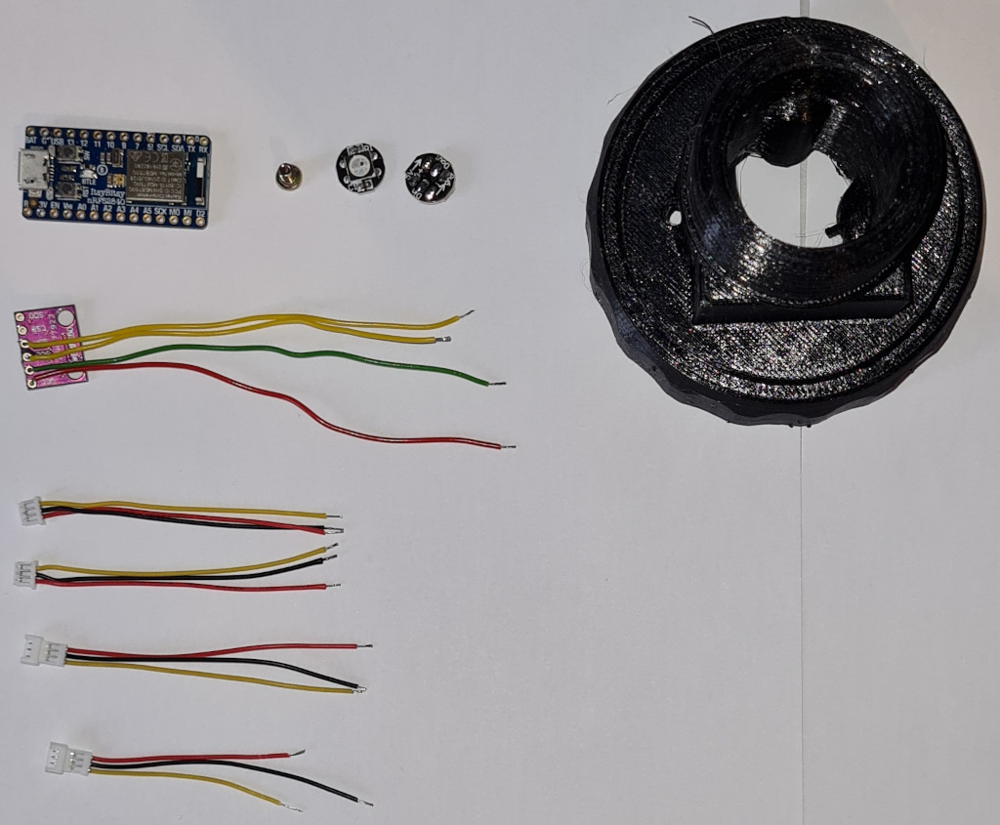
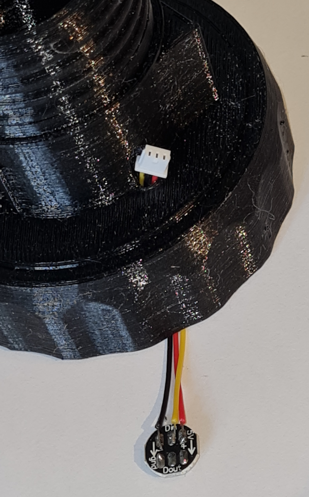
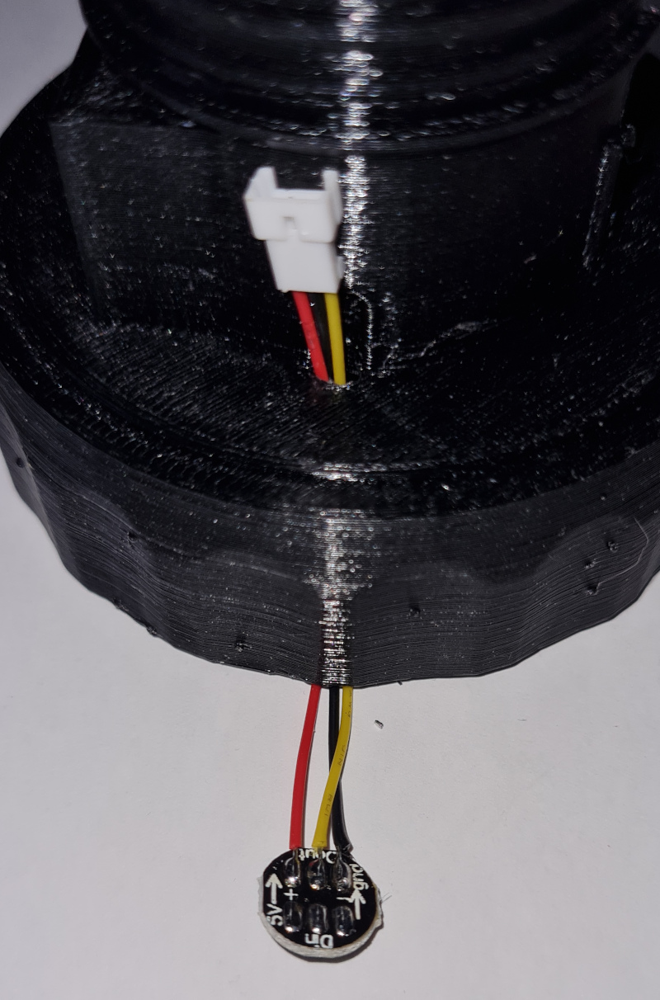
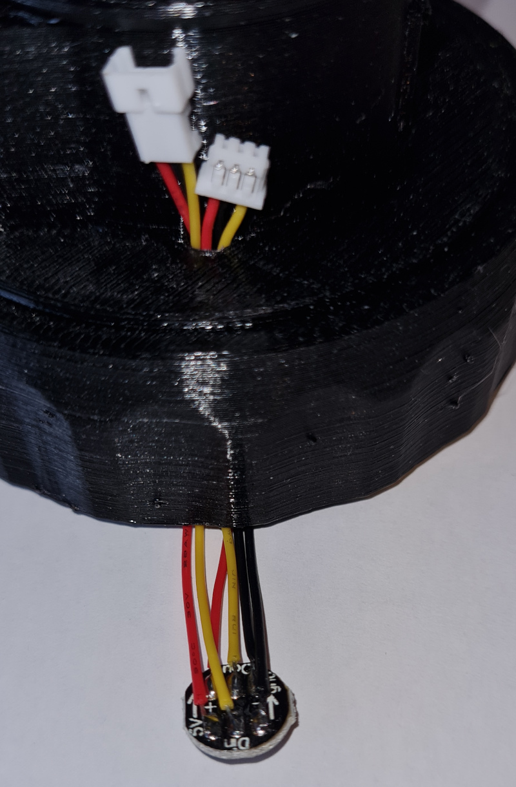
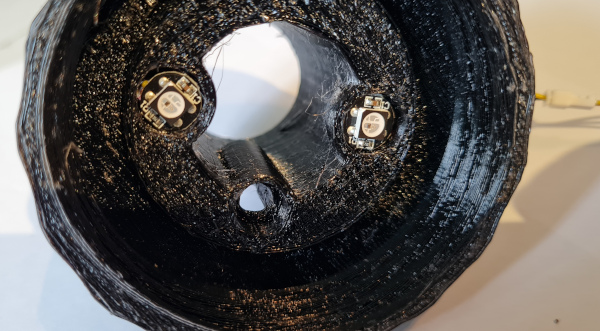
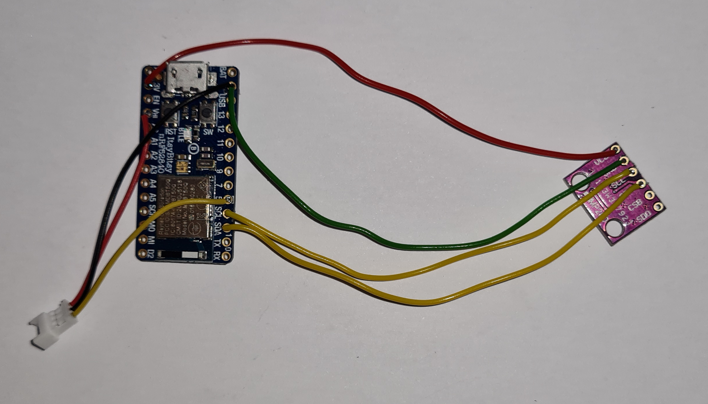
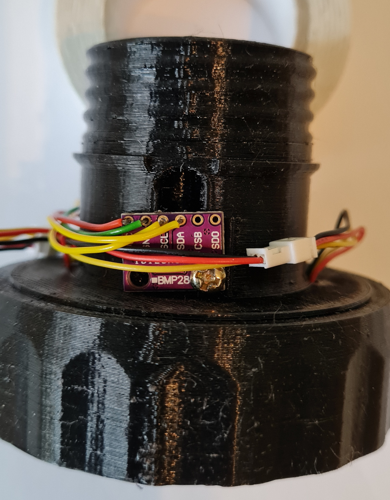
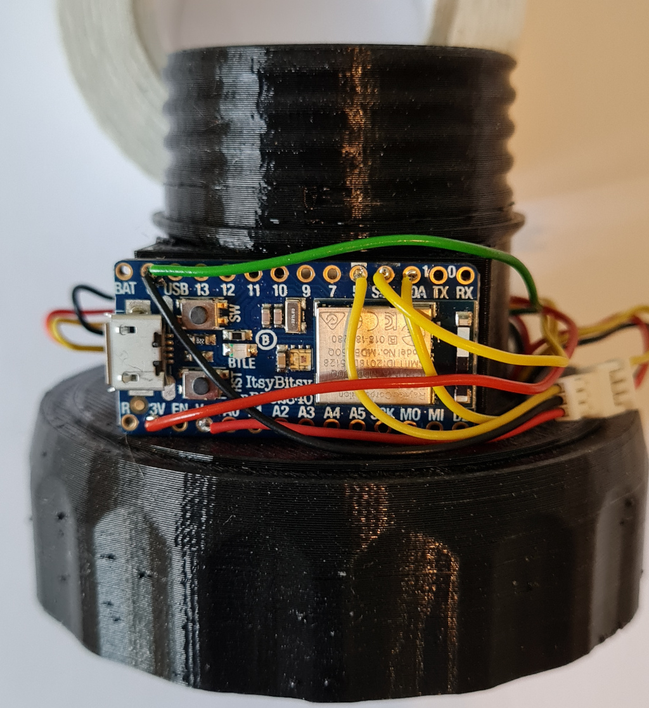

# Bubbler Bottle electronics and programming

## Parts list

* Adafruit Itsy Bitsy NRF52480 Express [(uk: Pimoroni)](https://shop.pimoroni.com/products/adafruit-itsybitsy-nrf52840-express-bluetooth-le)
* BMP280 Barometric pressure sensor [(uk: various ebay sellers)](https://www.ebay.co.uk/itm/283518687928)
* 2 pairs of micro 3 pin JST 1.25 connectors (or any small 3 pin connectors or just hard wire instead) [(uk: various ebay sellers)](https://www.ebay.co.uk/itm/301857866521)
* one or two M2.5 5mm screws
* Two WS2812b (neopixels) on small round PCB [(uk: various ebay sellers)](https://www.ebay.co.uk/itm/203167394144)
* A tiny bit of double sided foam tape (or hotglue)

## Construction

### Step 1

* Shorten 2 male and 1 female JST leads to around 60mm on all 3 connectors, strip, and tin
* Shorten the other female JST lead, black to around 55mm, red and yellow to around 40mm, strip
* Add thin wires to the BMP280 module so the wires come out on the blank side, trim the solder joints so they are not too prominent.  Solder wires about 100mm long to +v and gnd, and wires about 90mm long to SDA and SCL
* Add solder to the LED modules to aid assembly

### Step 2

* Feed a male JST through the left hole (with the flat mounting panel facing you). Solder it to one of the neopixels. Yellow is to DIN, Red is +5V, Black to gnd.

### Step 3

* Feed the 60mm-lead female JST through the right hole. Solder it to the other neopixel. Yellow is DOUT, Red is +5v, black to gnd.

### Step 4

* Feed the remaining male JST lead through the same hole and solder it to the other side of the neopixel. Yellow is DIN, Red is +5v, black to gnd. Solder it so the leads all exit from the same side if possible and be careful that DIN and DOUT are not touching

### Step 5

* Carefully push the leds back into the holes for them and bend the wires so they fit as flat as possible. You could install the LED covers at this point.

### Step 6

* Solder the remaining JST female and BCM280 board to the Itsy Bitsy.  Start with the GND wire where you need to fit two wires into the same hole.  With thin enough wires this should be fairly easy. Then the JST socket red wire goes to the VHI pin, and the JST socket yellow wire goes to the "5!" pin.

* Solder the other pins from the BCM280 board. The red leads goes to 3V, SCL to SCL, and finally SDA to SDA.

### Step 7

* You can mount the BMP280 board over the air hole using the M2.5 screw. Ensure the component side of the board is against the hole as shown. Connect all the JST cables and bend/tuck them out of the way.

### Step 8

* Secure the Itsy Bitsy board with a bit of double sided foam tape (or hotglue)

